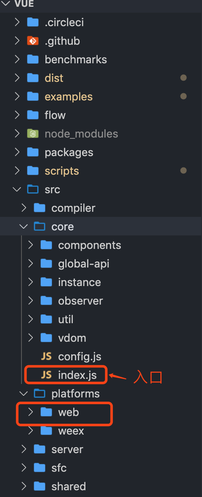

## vue源码解读 - 预备
>几个关键知识点
1. 源码使用 Flow 进行静态类型检查。
2. 源码模块打包工具 rollup
3. vue的父子组件的继承采用的是原型继承。
4. Object.defineProperty
5. 编译原理：[AST](https://astexplorer.net/)

### vue源码 - 目录结构
<div style="width: 50%;"></div>
      
### vue - 入口
> 调试模式：npm run dev

编译入口：src/platforms/web/entry-runtime-with-compiler.js

vue入口：src/core/index.js

### vue - 源码初始化解析
```js
import Vue from './instance/index'
import { initGlobalAPI } from './global-api/index'
import { isServerRendering } from 'core/util/env'
import { FunctionalRenderContext } from 'core/vdom/create-functional-component'

initGlobalAPI(Vue)

Object.defineProperty(Vue.prototype, '$isServer', {
  get: isServerRendering
})

Object.defineProperty(Vue.prototype, '$ssrContext', {
  get () {
    /* istanbul ignore next */
    return this.$vnode && this.$vnode.ssrContext
  }
})

// expose FunctionalRenderContext for ssr runtime helper installation
Object.defineProperty(Vue, 'FunctionalRenderContext', {
  value: FunctionalRenderContext
})

Vue.version = '__VERSION__'

export default Vue
```

一：vue类的初始化：
> 路径：core/index.js
```js
function Vue (options) {
  if (process.env.NODE_ENV !== 'production' &&
    !(this instanceof Vue)
  ) {
    warn('Vue is a constructor and should be called with the `new` keyword')
  }
  this._init(options)
}

initMixin(Vue)
stateMixin(Vue)
eventsMixin(Vue)
lifecycleMixin(Vue)
renderMixin(Vue)

export default Vue
```
此文件主要定义一个vue类，通过五个初始化方法往vue原型上挂在方法。
1. initMixin
挂载_init方法，用于实例初始化时调用。
```js
Vue.prototype._init = function (options?: Object) {
  //......
  //merge options
  vm.$options = mergeOptions(
    resolveConstructorOptions(vm.constructor),
    options || {},
    vm
  )

  //各种初始化
  initLifecycle(vm)
  initEvents(vm)
  initRender(vm)
  callHook(vm, 'beforeCreate')
  initInjections(vm) // resolve injections before data/props
  initState(vm)
  initProvide(vm) // resolve provide after data/props
  callHook(vm, 'created')
}
```
1. 实例初始化时调用 **this._init** 方法。**_init** 方法会merge传入的options，挂到this下。
2. **mergeOption** 主要作用是用于合并选项(将俩个选项对象合并成一个)，它是用于实例化和继承的核心函数。
3. options合并后，执行各种初始化方法。详细参考下面链接。

* mergeOption参考：[1.0 mergeOption](https://github.com/xinxingyu/js-power/blob/master/vue/1.0-mergeOption.md)
* initLifecycle参考：[1.1 initLifecycle](https://github.com/xinxingyu/js-power/blob/master/vue/1.1-initLifecycle.md)
* initEvents参考：[1.2 initEvents](https://github.com/xinxingyu/js-power/blob/master/vue/1.2-initEvents.md)